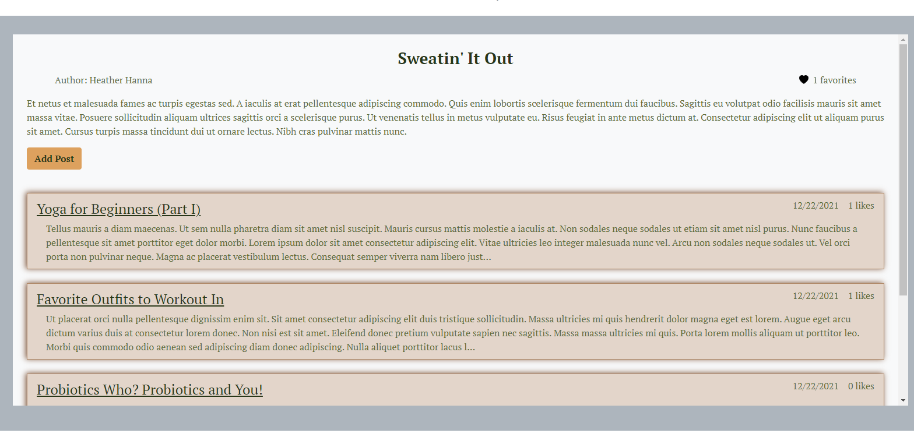
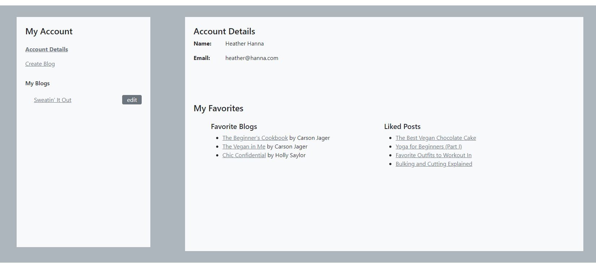

## Table of Contents
* [Background](#Background)
* [Features](#Features)
* [Technologies Used](#Technologies-Used)
* [Functionality](#Functionality)
* [Design and Future Plans](#Design-and-Future-Plans)

___

## Background
One of my 4am "I can't sleep but this would be really cool" ideas was to make a blog website where a user can customize their blog theme so it better matches their brand. As part of that, I wanted to have a blog preview when a user is creating their blog so that they could see what the blog would look like with all of the theme decisions they made. So, I decided I wanted to use React for the front-end, since that would make it extremely easy for the theme to update as changes would be made. React with Java/Spring wasn't something I was taught, so getting it all working together correctly took up most of my time and the themes aren't where I'd like them to be, but the proof of concept is there!

[Return to Table of Contents](#Table-of-Contents)

___

## Features
* General Features
    * Login and Registration with server side validations

      
      

    * Home Page with three random blog posts

      

    * Search feature to allow users to search for blog posts by title, author last name, and content

      

    * View blogs by category with the ability to get a random blog within that category

    

    * View a blog

    

    * View a blog post

    

* Logged In User Features  
    * View account details, blogs the user has created and blogs/posts that the user has liked
    ###### Red text indicates features that have not been added, but will be added

    

    * Create a blog
    

    * Edit/delete a blog
    

    * Add a blog post
    

    * Edit/delete a blog post
    

    * Comment on a blog post
    

[Return to Table of Contents](#Table-of-Contents)
___

## Technologies Used
* React, HTML, CSS, and Bootstrap -- clean, responsive, single page UI
* Spring Boot, Java, RESTful routing -- created an API for the front-end to call on to perform CRUD operations
* MySQL -- one-to-many and many-to-many relationships to allow users to interact with blogs
* Server-side validations and Spring Security to limit user access to resources
* BCrypt and Regex to ensure password complexity

[Return to Table of Contents](#Table-of-Contents)

___

## Functionality
Upon loading the web application, the user arrives on the home page which has 3 unique, random blog posts with a preview. From there, the user is able go directly to that post to read it if they are interested in any of them. If none of them are appealing, the user could search for posts with the search feature, or view blogs by category to find something they do want to look at. If the user wants to do anything more than search or read blogs and their posts, then they will need to login.

Once the user has logged in, they will be able to view their account which opens them up to creating, editing and deleting blogs. They will also be able to add, editt and delete posts for their blog, and comment on their own and other people's posts..

When a user creates a blog, they have four themes to choose from. Each theme has a special color scheme and font to distinguish them. This allows users to create a blog that better matches their brand. These themes affect only their blogs and blog posts.

[Return to Table of Contents](#Table-of-Contents)

___

## Design and Future Plans
As mentioned in the Background, the original idea for this project was to have customizable themes for blogs. Integrating React with Java/Spring was more time consuming than I expected, so it is only to the point of proof of concept at the moment. I plan to allow users to use a color picker to customize various elements, and be able to select from a few different fonts. Super end goal would be to make a sort of WYSIWYG editor for the user.

I also plan to allow users to upload an image to the blog posts. First, I would only allow them to upload one image, however if I get to the point of the WYSIWYG editor I could allow them to add multiple images and place them wherever they wanted.

I had the ability to favorite a blog and like individual posts that would be displayed in My Account, however I broke something crucial and in my panic I reverted back to my previous git version and lost those features. They will be added back in. Lesson learned...

I would like to add pagination, but I need to figure out a way to DRY up the code I would need to do that since I would want it on many different views of the app.

Currently, this is not mobile/tablet friendly. I would like to make version that would be responsive based on screen size since that is extremely important in today's world.

[Return to Table of Contents](#Table-of-Contents)
